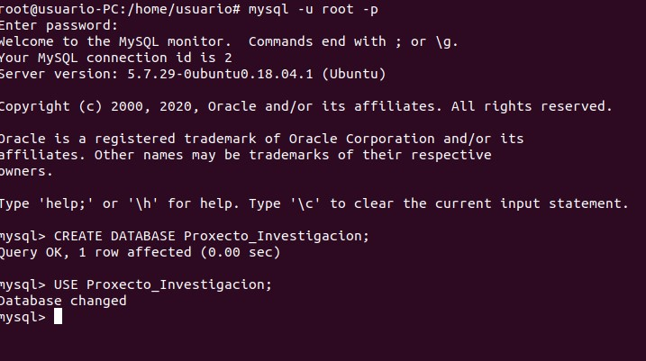

# Crear Base de datos Proyecto_Investigacion.
1. Para crear la base de datos ejecutamos el comando CREATE DATABASE Proyecto_Investigacion; y para usarla escribimos USE Proyecto_Investigacion;

## Codigo SQL Proyecto_Investigacion
2. Usaremos el codigo Sql que tenemos escrito en gits para crear las tablas con el comando CREATE TABLE
[codigo sql](https://gist.github.com/adrianbaldonedo/7881acc2c3a644ab221ab3013a8e3caa#file-investigacion-sql)

#### Codigo SQL Naves espaciales
3. Para crear la base de datos ejecutamos el comando CREATE DATABASE Naves_espciales y para usarla escribimos USE naves_espaciales; 
4. Usaremos el codigo Sql que tenemos escrito en gits para crear las tablas con el comando CREATE TABLE y creamos las tablas con el siguiente codigo 
[codigo sql](https://gist.github.com/adrianbaldonedo/7881acc2c3a644ab221ab3013a8e3caa#file-nespaciales-sql)
