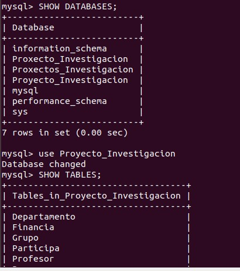
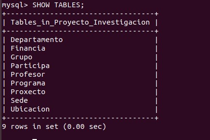
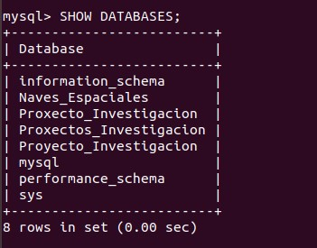
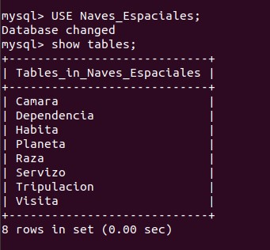
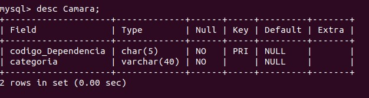
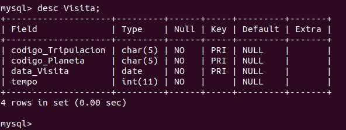

# Uso de los comandos para ver las tablas.
1. Para crear la base de datos ejecutamos el comando CREATE DATABASE naves-espaciales; y para usarla escribimos USE naves_espaciales;

2. Una vez creadas todas las tablas y dadas de alta para ver que todo esta correctamente usaremos show database para ver que tenemos la base de datos creada nos pasamos con use Proyecto_Investigacion; a la base de datos y usamos show tables; para ver las tablas creadas

3. Para ver el contenido de las tablas usaremos el comando desc y el nombre de la tabla y veremos el contenido.

4. Para ver la base de datos creada usamos el show database

5. Nos pasamos a la base de datos con el use naves_espaciales; y hacemos un show tables para ver las tablas creadas

6. Para ver el contenido de las tablas usaremos el desc y el nombre de las tablas.

